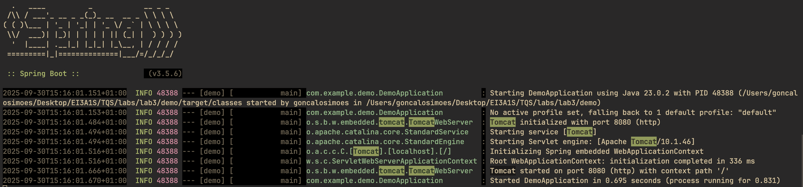
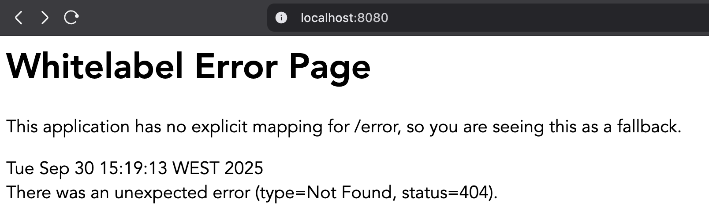
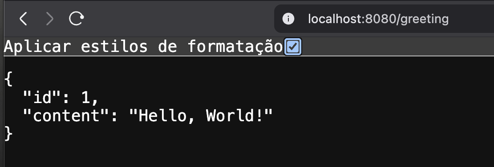
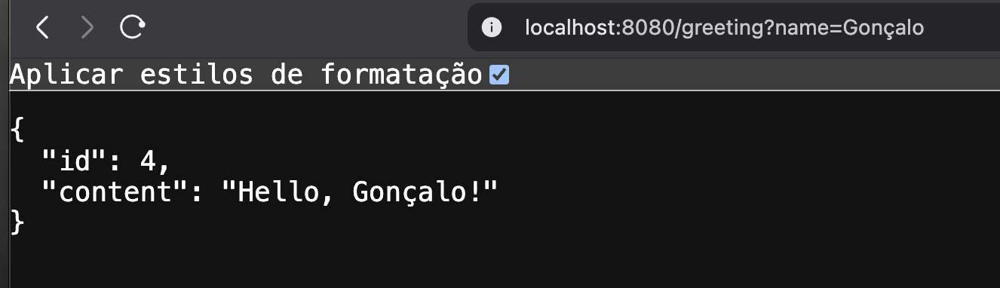

## Screenshots Spring Boot Web App

### 3.1

Spring Boot é um conjunto de ferramentas/framework da ecosfera Spring que facilita muito o desenvolvimento de aplicações Java “enterprise” (empresariais), stand-alone, prontas para produção. A ideia central é reduzir a complexidade de configuração e arrancamento, favorecendo convenções (“convention over configuration”) e auto-configuração, de modo que o programador tenha de escrever menos código de apoio, menos XML ou configurações manuais, e possa focar na lógica de negócio.

---

### 3.2 - Alínea (b)

Usamos o Apache Tomcat nesta aplicação de Spring Boot como um servlet container de forma a correr a aplicação Java de uma maneira mais rápida e fácil.

  

  

  

  

---

### 3.3 - Alínea (b)

#### 1. Camadas do Projeto

1. **Boundary / Web Layer**: lida com pedidos e respostas HTTP.
2. **Service / Business Layer**: contém a lógica de negócio central.
3. **Data / Persistence Layer**: gere a interação com a base de dados.

Esta separação garante que cada camada tenha **uma responsabilidade clara**, tornando o código mais organizado e fácil de testar.

#### 2. Packages e respetivas Funções

### `boundary`

- **Descrição:** Camada de entrada da aplicação.
- **Conteúdo:** Controllers e exceções HTTP.
- **Exemplos:**
  - `GreetingController.java`
  - `IndexController.java`
  - `UserRestController.java`
  - `ResourceNotFoundException.java`
- **Função:**
  - Receber pedidos HTTP.
  - Delegar a lógica para a camada de serviços.
  - Retornar respostas (HTML, JSON, etc.).
- **Justificativa:** Mantém as preocupações da interface web separadas da lógica de negócio.

### `services`

- **Descrição:** Camada de lógica de negócio.
- **Conteúdo:** Interfaces e implementações de serviços.
- **Exemplos:**
  - `UserService.java` (interface)
  - `UserServiceImpl.java` (implementação)
- **Função:**
  - Executar regras de negócio.
  - Orquestrar operações entre dados e boundary.
- **Justificativa:** Garante que a lógica seja **independente do método de requisição**, podendo ser reutilizada e testada isoladamente.

### `data`

- **Descrição:** Camada de persistência.
- **Conteúdo:** Entidades e repositórios JPA.
- **Exemplos:**
  - `User.java` (entidade)
  - `UserRepository.java` (repositório)
- **Função:**
  - Encapsular interações com o banco de dados.
- **Justificativa:** Permite **alterações no banco de dados** sem impactar a lógica de negócio ou os controllers.

---

**Conclusão:** A divisão em `boundary`, `services` e `data` segue o princípio de **Separation of Concerns**, permitindo que cada camada concentre-se numa única responsabilidade, aumentando a clareza, manutenção e testabilidade do sistema.
"""